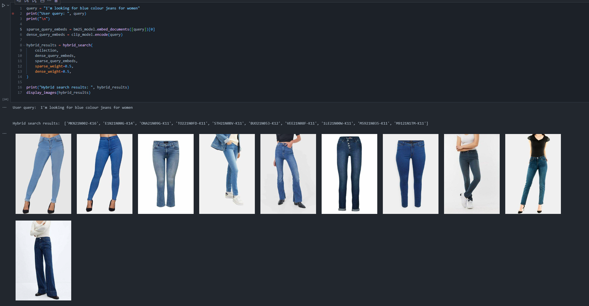

# Zalando Bot: AI-Powered Fashion Assistant

* [REPO: Zalando Bot: AI-Powered Fashion Assistant](https://github.com/ThivaV/zalando_query_bot)
* [NOTEBOOK: Data preparation and Milvus DB creation - zalando_query_bot_v1.2.ipynb](notebooks/zalando_query_bot_v1.1.ipynb)
* [NOTEBOOK: Hybrid Search - zalando_query_bot_v1.2.ipynb](notebooks/zalando_query_bot_v1.2.ipynb)
* [APP: Zalando Bot: AI-Powered Fashion Assistant - Streamlit application](src/)

## Project Overview

The **Zalando Bot** is a Large Language Model (LLM) powered chatbot designed to assist users in searching for garments available on the Zalando platform. By interacting with the bot, users can describe or ask for fashion items, and the bot will return relevant search results using both dense and sparse product retrieval techniques.

## Key Features

1. User-Friendly Fashion Search:
    * The chatbot allows users to interact naturally by describing the type of clothing they are looking for, such as "show me red dresses"
    * It enhances the shopping experience by making it conversational.
2. Dataset:
    * The dataset used for this project was scraped directly from Zalando’s website and contains information about a variety of garments, including images, descriptions, and metadata.
    * The dataset has been published on Huggingface and is available at [thivav/zalando_fashionista_x300](https://huggingface.co/datasets/thivav/zalando_fashionista_x300).
3. Hybrid Product Retrieval:
    * The system utilizes a **hybrid search approach** combining **dense and sparse retrieval**:
        * **Dense Retrieval:** Implemented using **OpenAI CLIP**, which generates image embeddings that capture the visual characteristics of the garments. This method excels in retrieving visually similar items.
        * **Sparse Retrieval:** Implemented using the **BM25 algorithm**, which works on the text descriptions of the garments. This method is effective for keyword-based search.

        

4. Embedding Storage with **Milvus**:
    * All embeddings, both dense and sparse, are stored in the **Milvus vector database**, a specialized database for efficient vector retrieval.
    * When the bot processes a query, it retrieves relevant product embeddings from Milvus and presents the best matches to the user.
5. **LLM-RAG Integration**:
    * The **Retrieval-Augmented Generation (RAG)** framework is implemented using **Google Gemma2:2B LLM**.
    * The LLM takes the user’s query, retrieves relevant product embeddings from Milvus, and generates a response based on those embeddings.
6. Accuracy and Performance:
    * Sparse retrieval (BM25) works well for text-heavy queries, while dense retrieval (CLIP) provides excellent performance for visual search.

## System Architecture

1. **Data Collection:**
    * Data was scraped from Zalando's website, including product images and descriptions, and uploaded to Huggingface for public access.
2. **Embedding Generation:**
    * OpenAI CLIP was used to generate dense vector embeddings for product images.
    * BM25 was applied for sparse retrieval of textual descriptions.
3. **Vector Storage:**
    * The embeddings were stored in the **Milvus vector database**, which supports high-dimensional vector search and retrieval.
4. **LLM-RAG Framework:**
    * **Google Gemma2:2B** serves as the LLM to handle user queries and retrieve relevant information using the hybrid search strategy.
    * The system uses the retrieved context (product embeddings) to answer user questions or provide product recommendations.

## Conclusion

The **Zalando Bot: AI-Powered Fashion Assistant** revolutionizes fashion search by combining LLM-powered conversational capabilities with advanced hybrid search techniques. By integrating dense and sparse retrieval methods, users can enjoy an intuitive and efficient shopping experience, interacting naturally with the bot to discover Zalando products. The project highlights the potential of LLM and retrieval technologies in the fashion industry.

## References

1. OpenAI CLIP – Multimodal embedding for image and text retrieval: OpenAI CLIP
2. BM25 Algorithm – Keyword-based retrieval: BM25 Algorithm
3. Milvus Vector Database – High-dimensional vector retrieval: Milvus
4. Google Gemma2:2B LLM – Multimodal language model for contextual retrieval: Google Gemma2 LLM
5. `Zalando Fashionista Dataset X300` Huggingface Dataset (2024). [Zalando Fashionista X300 Dataset](https://huggingface.co/datasets/thivav/zalando_fashionista_x300)